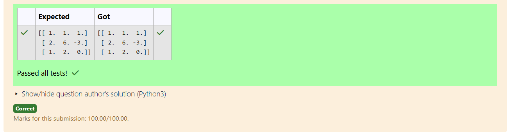

# INVERSE-OF-A-MATRIX
## Aim:
To write a python program to find the inverse of a matrix
## Equipment’s required:
1. 	Hardware – PCs
2. 	Anaconda – Python 3.7 Installation / Moodle-Code Runner
## Algorithm:
### Step1 : Import numpy to perform the inverse of matrix opeartion
### Step 2: Create the matrix to find the inverse,representing as a Numpy array
### Step 3: Use the numpy, linalg.det() function to ensure the determination of matrix is non singular matrix have inverses
### Step 4: End of th program

## Program:
    #Program to find the inverse of a matrix.
    #Developed by: Preetha.K
    #RegisterNumber: 24900266
    import numpy as np
    a=np.array([[ 6,2,3],[3.,1,1],[10,3,4]])
    res=np.linalg.inv(a)
    print(res)
## Output:

## Result:
Thus the inverse of given matrix is successfully solved using python program

